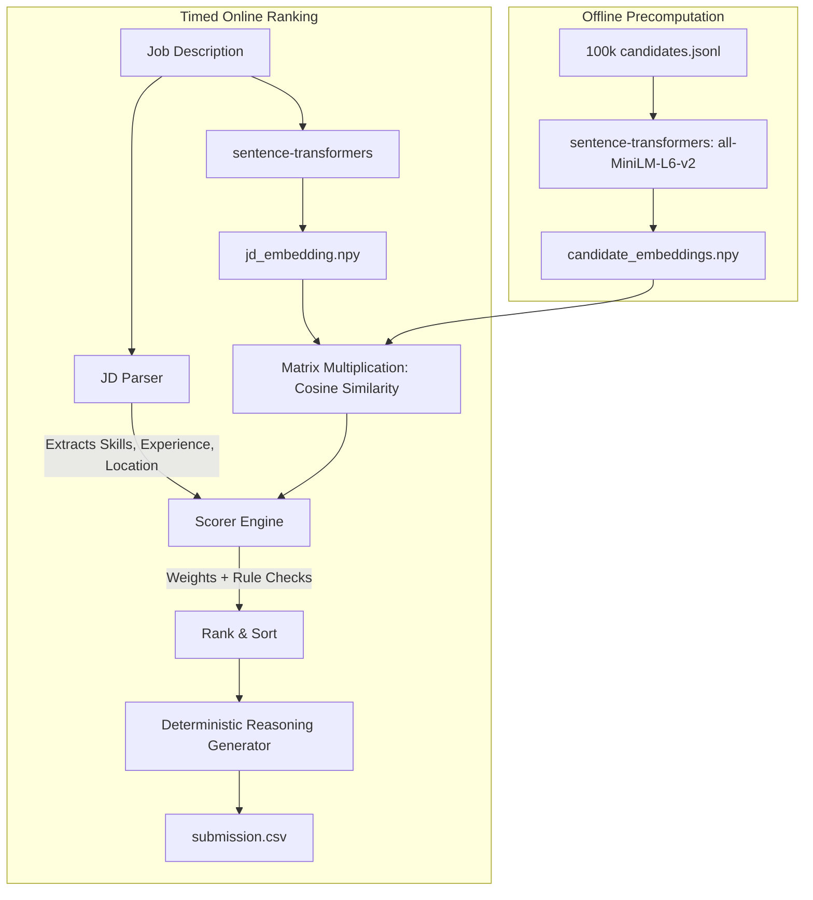

# 📊 RedrAI - Candidate Ranking Engine

An optimized, hybrid ranking system that evaluates candidate profiles against a Job Description. This engine is built specifically to operate under strict constraints: it evaluates 100k candidates in under a minute on CPU, utilizing precomputed embeddings for the heavy lifting and deterministic rule-based checks for domain relevance.

This is the **INDIA RUNS Hackathon 2026 by Redrob** submission for Team **Pixentropy**. 

---

## 🌐 Live Streamlit Sandbox
We built an interactive UI to test our engine on a representative 10,000-candidate sample dataset. 

**Try it here:** [RedrAI Streamlit App](https://redrai-pixentropy.streamlit.app)

---

## 🏗️ Architecture & Data Flow

RedrAI is designed as a **highly tunable black box**. All algorithmic logic — from component weights to penalty thresholds—is centralized in `src/config.py`. By tuning these weights, the engine can be dynamically adapted for different hiring profiles without changing a single line of business logic.



### ⚡ Performance Optimizations
To meet the 5-minute CPU-only compute budget for 100,000 candidates, we completely separated the heavy ML inference from the ranking step. We run the `sentence-transformers` embedding generation **offline** (a one-time process that takes ~2 hours). During the timed online ranking, we use pure **NumPy matrix multiplication** to compute cosine similarity across the entire 100,000x384 matrix in one vectorized operation. This reduces the live semantic comparison time to a fraction of a second, easily fitting within the 5-minute budget.

---

## ✨ Core Features

1. **Semantic Similarity (`semantic_score`)**: Compares the narrative text of each candidate's career history against the provided JD. Candidate embeddings are precomputed offline, while the JD is embedded live at runtime.
2. **Skill Matching & Depth (`skill_depth_score`)**: Checks exact overlap against the core skills found in the dataset. It doesn't just count skills; it weighs proficiency levels, endorsement volume, and usage duration to score true depth of knowledge.
3. **Keyword Stuffer Protection**: We aggressively penalize candidates who claim many required skills but do not have a relevant role in their recent career history (e.g., Mechanical Engineers claiming AI skills).
4. **Experience Fit (`experience_fit_score`)**: Matches the candidate's years of experience against the parsed bounds of the JD and detects "stale coders" (candidates who transitioned to non-coding management roles years ago).
5. **Behavioral Signals (`behavioral_score`)**: Integrates Redrob's behavioral signals to prioritize active, highly responsive candidates who match location and notice-period requirements. Missing data (`-1`) is handled gracefully so candidates aren't artificially punished.
6. **Honeypot Detection**: Deterministically flags internally inconsistent profiles (e.g., claiming 40 months of experience with a tool, but only having 20 months of total career experience) and forces them out of the ranking. 
7. **Deterministic Reasoning**: Output reasoning strings are generated without an LLM. They pull directly from computed facts to guarantee zero hallucinations and instantaneous generation.

---

## 🧮 The Scoring Formula

Every candidate is evaluated using a core weighted formula, followed by conditional penalty/boost multipliers:

```python
raw_score = (
    (semantic_score      * WEIGHTS["semantic_score"]) +
    (skill_combined      * WEIGHTS["skill_depth_score"]) +
    (experience_combined * WEIGHTS["experience_fit_score"]) +
    (behavioral_combined * WEIGHTS["behavioral_score"])
)
```

**Multiplier Adjustments:**
- **`HIGHLY_RELEVANT_TITLE_BOOST` (x1.2)**: Boosts candidates with domain-specific titles (e.g., "ML Engineer") over generic titles (e.g., "Software Engineer") for specialized AI roles.
- **`KEYWORD_STUFFER_PENALTY` (x0.4)**: Heavy penalty applied if a candidate hits the `HIGH_SKILL_MATCH_THRESHOLD` but fails the `RELEVANT_TITLE_KEYWORDS` check.
- **`IRRELEVANT_TITLE_PENALTY` (x0.3)**: Standard penalty for completely irrelevant career backgrounds.
- **`LOW_SKILL_MATCH_PENALTY` (x0.5)**: Applied if a candidate has high semantic overlap (generic good English) but fails to possess the `MIN_SKILL_MATCHES_FOR_FULL_SCORE` core technical skills.
- **Disqualifiers**: The score is finally multiplied by penalties like `SERVICES_PENALTY` or `RESEARCH_PENALTY` if the candidate's background is exclusively non-product-focused.

---

## 🚀 Setup & Usage

**1. Install dependencies:**
```bash
pip install -r requirements.txt
```

**2. (Optional) Run the Streamlit Sandbox:**
Launch an interactive UI to test the engine on our 5,000-candidate sample dataset.
```bash
streamlit run app.py
```

**3. (Offline) Precompute Embeddings (For Full 100k Dataset):**
*Note: Only run this if the `candidates.jsonl` changes.*
```bash
python -m src.precompute_embeddings --jd_file data/raw/job_description.docx
```

**4. (Online) Rank Candidates (Timed Run):**
Generates `submission.csv` in the `output/` directory in under 1 minute for all 100k candidates.
```bash
python -m src.rank --jd_file data/raw/job_description.txt
```

**5. Validate Output:**
```bash
python validate_submission.py output/submission.csv
```

---

## 👥 Team Details
### Pixentropy
- Swastik Bose 